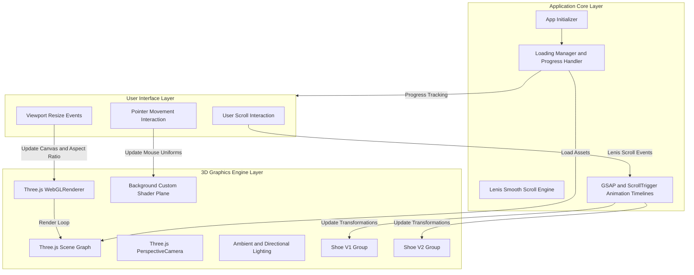
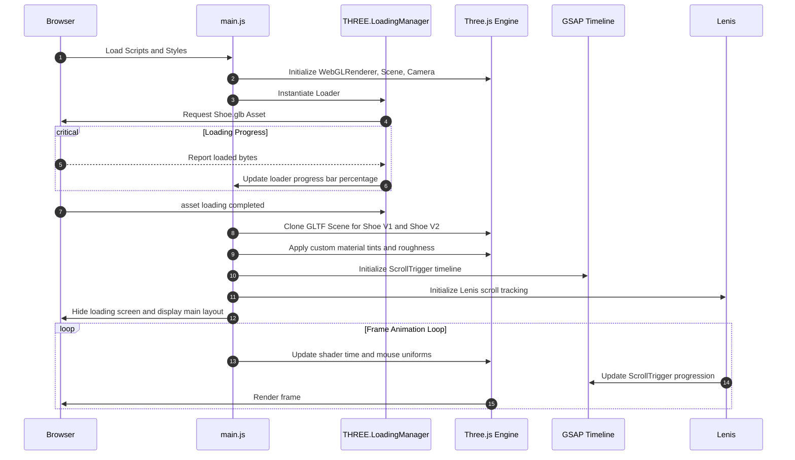

# AETHER 3D - Interactive Footwear Showcase

Aether 3D is a high-performance, web-based 3D shoe customizer and product showcase. The application leverages modern rendering techniques and hardware-accelerated animations to deliver a premium, interactive product experience. The project is designed with a scroll-driven narrative that guides the user through the technical specifications and engineering features of two iterations of the flagship shoe model.

Live Deployment: [Aether 3D on Vercel](https://task-1-threejs-shoe.vercel.app)
GitHub Repository: [task-1-threejs-shoe](https://github.com/babarnaeem0001/task-1-threejs-shoe)

---

## Architecture Overview

The application is structured as a single-page application built on top of the Vite bundler. It integrates a 3D rendering pipeline with scroll-based triggers to synchronize 3D camera animations with HTML content.

### System  Architecture



### Execution and Initialization Flow



---

## Technical Features

### 1. Synchronized Scroll Animations
The core of the storytelling experience is powered by GSAP and its ScrollTrigger plugin. A pinned canvas wrapper ensures that the 3D model remains fixed in the background while the user scrolls through the description slides.
- **Precise Timing Alignment**: The animation timeline spans multiple scroll-activated sections. Transitions (rotation, position, and scale) of the 3D assets are linked to specific scroll regions.
- **Smooth Model Swaps**: As the user transition from the V1 specifications to the V2, Shoe V1 is translated out of the viewport and scaled down, while Shoe V2 is brought into view with a rotation animation.

### 2. Procedural Background Shaders
Rather than relying on flat colors or resource-heavy background videos, the 3D stage features a background plane mapped with a custom ShaderMaterial.
- **Vertex Shader**: Projects standard coordinates.
- **Fragment Shader**: Renders a dynamic wave and grid pattern. The shader updates its colors and grid lines in real-time based on the mouse position coordinates (`uMouse` uniform) and elapsed runtime (`uTime` uniform).
- **Interpolation**: Mouse coordinates are smoothed using linear interpolation (lerping) inside the animation loop to ensure movement transitions are fluid.

### 3. Mesh Cloning and Optimization
To present V1 and V2 models efficiently, the application avoids downloading two distinct 3D files.
- The base model `Shoe.glb` is loaded once via `GLTFLoader`.
- The scene is cloned programmatically using Three.js mesh cloning.
- The cloned objects are traversed, and their materials are customized (changing colors, roughness, and metalness values) to create two unique model versions.

### 4. Advanced Smooth Scroll Mechanics
Integrating Lenis Scroll ensures that the scroll events are normalized across different devices and operating systems. The scroll loop feeds directly into the GSAP ticker, optimizing the CPU/GPU thread sync.

---

## Technology Stack

The project relies on a production-ready client-side stack:
- **Core Engine**: Three.js (r128+)
- **Asset Loader**: GLTFLoader
- **Animation Framework**: GSAP 3 (with ScrollTrigger)
- **Scroll Rigging**: Lenis Scroll (1.1+)
- **Bundler & Dev Server**: Vite
- **Styling**: Vanilla CSS with modern custom variables, glassmorphism filters, and flex/grid responsive systems.

---

## Project Structure

A layout of the codebase structure:

```
├── public/                 # Static assets
│   ├── favicon.svg         # Favicon icon
│   ├── shoe1.png           # Fallback image assets
│   ├── shoe2.png           # Fallback image assets
│   └── Shoe.glb            # Three.js 3D model
├── src/                    # Source files
│   ├── main.js             # Application entry point, Three.js setup, GSAP timeline
│   └── styles.css          # Core layouts, theme variables, and responsive UI styles
├── index.html              # HTML entry wrapper
├── package.json            # Node dependencies and scripts
└── package-lock.json       # Dependency tree lockfile
```

---

## Installation and Local Development

Follow these steps to run the project locally.

### Prerequisites
- Node.js (v18.0.0 or higher recommended)
- npm or yarn

### Setup Instructions

1. **Clone the Repository**
   ```bash
   git clone https://github.com/babarnaeem0001/task-1-threejs-shoe.git
   cd task-1-threejs-shoe
   ```

2. **Install Dependencies**
   ```bash
   npm install
   ```

3. **Start the Development Server**
   ```bash
   npm run dev
   ```
   Open your browser to the local URL displayed in the terminal (usually `http://localhost:5173`).

4. **Production Build**
   To build and optimize the project for deployment:
   ```bash
   npm run build
   ```
   This will generate static production assets in the `dist` directory.
